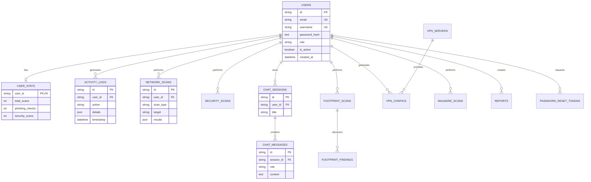

# 🗄️ Database Schema

This document details all database tables, their relationships, and the ER diagram for Fsociety.

---

## Table of Contents

- [Overview](#overview)
- [ER Diagram](#er-diagram)
- [Tables](#tables)
- [Relationships](#relationships)
- [Design Decisions](#design-decisions)
- [Potential Improvements](#potential-improvements)

---

## Overview

Fsociety uses **SQLite** as the default database, with **SQLAlchemy ORM** for database operations. The schema is designed to be:

- **Normalized** to reduce data redundancy
- **Indexed** on frequently queried columns
- **Foreign Key Constrained** to maintain referential integrity

### Database Location

```
backend/data/fsociety.db
```

---

## ER Diagram



---

## Tables

### 1. users
The central table storing user accounts.

| Column | Type | Constraints | Description |
|--------|------|-------------|-------------|
| id | VARCHAR(36) | PK | UUID |
| email | VARCHAR(255) | UNIQUE, NOT NULL | User email |
| username | VARCHAR(50) | UNIQUE, NOT NULL | Username |
| password_hash | TEXT | NOT NULL | bcrypt hash |
| refresh_token | TEXT | NULL | JWT refresh token |
| refresh_token_expires_at | DATETIME | NULL | Token expiry |
| full_name | VARCHAR(100) | NULL | Display name |
| phone | VARCHAR(20) | NULL | Phone number |
| company | VARCHAR(100) | NULL | Company name |
| bio | TEXT | NULL | User bio |
| role | VARCHAR(20) | DEFAULT 'user' | 'user' or 'admin' |
| is_active | BOOLEAN | DEFAULT TRUE | Account status |
| created_at | DATETIME | NOT NULL | Registration time |
| updated_at | DATETIME | NULL | Last update |
| last_login_at | DATETIME | NULL | Last login time |
| last_login_ip | VARCHAR(45) | NULL | IPv6 compatible |
| password_changed_at | DATETIME | NULL | Password change time |

### 2. user_stats
One-to-one with users, stores usage statistics.

| Column | Type | Description |
|--------|------|-------------|
| user_id | VARCHAR(36) | PK, FK → users.id |
| total_scans | INTEGER | Total scans performed |
| phishing_checks | INTEGER | Phishing URLs checked |
| security_scans | INTEGER | Security audits run |
| file_analysis | INTEGER | Files analyzed |
| vpn_configs | INTEGER | VPN configs generated |
| reports_generated | INTEGER | Reports created |
| malware_detected | INTEGER | Malware found |
| last_active | DATETIME | Last activity time |

### 3. activity_logs
Audit trail for user actions.

| Column | Type | Description |
|--------|------|-------------|
| id | VARCHAR(36) | PK |
| user_id | VARCHAR(36) | FK → users.id (SET NULL on delete) |
| action | VARCHAR(50) | Action type (login, logout, scan, etc.) |
| details | JSON | Action metadata |
| ip_address | VARCHAR(45) | Client IP |
| user_agent | TEXT | Browser info |
| timestamp | DATETIME | When action occurred |

### 4. network_scans
Results from network scanning operations.

| Column | Type | Description |
|--------|------|-------------|
| id | VARCHAR(36) | PK |
| user_id | VARCHAR(36) | FK → users.id |
| scan_type | VARCHAR(30) | Type: port, service, os_detect |
| target | VARCHAR(255) | IP or hostname |
| status | VARCHAR(20) | pending, running, completed, failed |
| results | JSON | Scan output |
| error | TEXT | Error message if failed |
| started_at | DATETIME | Scan start time |
| completed_at | DATETIME | Scan end time |
| duration_ms | INTEGER | Duration in milliseconds |

### 5. security_scans
SSL, header, and phishing analysis results.

| Column | Type | Description |
|--------|------|-------------|
| id | VARCHAR(36) | PK |
| user_id | VARCHAR(36) | FK → users.id |
| category | VARCHAR(30) | ssl, headers, phishing |
| target | TEXT | URL or domain |
| risk_level | VARCHAR(20) | low, medium, high, critical |
| results | JSON | Detailed findings |
| created_at | DATETIME | When performed |

### 6. chat_sessions
AI chat conversation sessions.

| Column | Type | Description |
|--------|------|-------------|
| id | VARCHAR(36) | PK |
| user_id | VARCHAR(36) | FK → users.id |
| title | VARCHAR(100) | Session title |
| created_at | DATETIME | Created time |
| updated_at | DATETIME | Last message time |

### 7. chat_messages
Individual messages within chat sessions.

| Column | Type | Description |
|--------|------|-------------|
| id | VARCHAR(36) | PK |
| session_id | VARCHAR(36) | FK → chat_sessions.id |
| role | VARCHAR(20) | 'user' or 'assistant' |
| content | TEXT | Message content |
| timestamp | DATETIME | When sent |

### 8-9. footprint_scans & footprint_findings
Digital footprint OSINT results.

### 10-11. vpn_servers & vpn_configs
VPN server list and user configurations.

### 12. malware_scans
File analysis and malware detection results.

### 13. reports
Generated PDF reports.

### 14. password_reset_tokens
OTP tokens for password recovery.

---

## Relationships

### One-to-One
```
users (1) ────── (1) user_stats
```

### One-to-Many
```
users (1) ────── (N) activity_logs
users (1) ────── (N) network_scans
users (1) ────── (N) security_scans
users (1) ────── (N) chat_sessions
users (1) ────── (N) footprint_scans
users (1) ────── (N) vpn_configs
users (1) ────── (N) malware_scans
users (1) ────── (N) reports
users (1) ────── (N) password_reset_tokens

chat_sessions (1) ────── (N) chat_messages
footprint_scans (1) ────── (N) footprint_findings
vpn_servers (1) ────── (N) vpn_configs
```

### Cascade Delete Rules
- **CASCADE**: Delete child records when parent deleted (most relationships)
- **SET NULL**: Keep activity_logs when user deleted (audit preservation)

---

## Design Decisions

### Why UUID for Primary Keys?

| Reason | Benefit |
|--------|---------|
| **Uniqueness** | Guaranteed unique across systems |
| **Security** | IDs are not guessable |
| **Distributed** | No central sequence needed |

### Why Store Refresh Token in users Table?

Originally, refresh tokens had a separate table. We merged it into `users` because:
1. One refresh token per user
2. Simpler queries
3. Automatic cascade on user delete

### Why JSON Columns for Results?

Scan results have variable structure. JSON columns allow:
1. Flexible schema
2. No schema migrations for new fields
3. Easy serialization

---

## Potential Improvements

### 1. Separate Refresh Tokens Table
**Why**: Multiple devices could have multiple tokens
```sql
CREATE TABLE refresh_tokens (
    id TEXT PRIMARY KEY,
    user_id TEXT REFERENCES users(id),
    token TEXT NOT NULL,
    device_info TEXT,
    expires_at DATETIME
);
```

### 2. Indexing Strategy
**Current**: Basic indexes on FKs
**Improvement**: Composite indexes for common queries
```sql
CREATE INDEX idx_scans_user_type ON network_scans(user_id, scan_type);
CREATE INDEX idx_activities_user_time ON activity_logs(user_id, timestamp DESC);
```

### 3. Table Partitioning (PostgreSQL)
For large-scale deployment, partition `activity_logs` by month.

### 4. Read Replicas
For scaling, add read replicas for dashboard queries.

---

## Related Documentation

- [SQLAlchemy ORM](./sqlalchemy.md)
- [Database Commands](./commands.md)
- [Viva Questions](./viva_questions.md)
