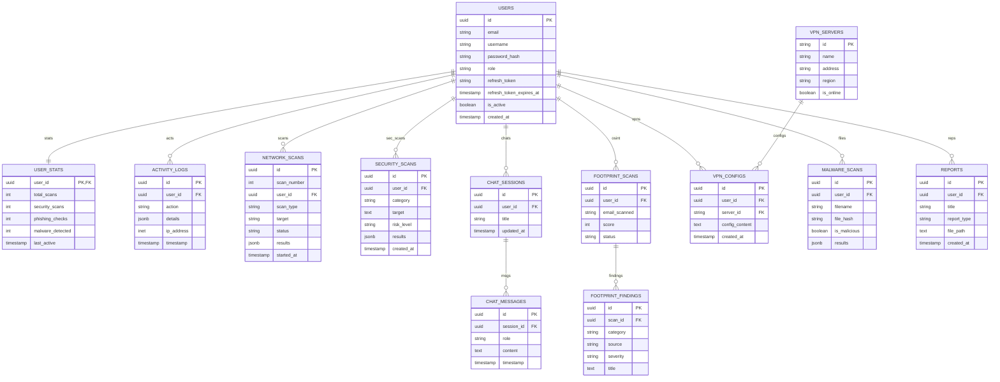

# Entity Relationship Diagram (ERD)

The following diagram visualizes the relationships between the Fsociety database entities.

## Key Relationships

1.  **Users (Central Hub)**:
    -   Stores authentication, profile, and session state (`refresh_token`).
    -   One-to-One with `USER_STATS` for performance.
    -   One-to-Many with all activity and scan history.

2.  **Sessions & Messages**:
    -   Hierarchical relationship between `CHAT_SESSIONS` and `CHAT_MESSAGES`.

3.  **Scans & Findings**:
    -   `FOOTPRINT_SCANS` extracts multiple `FOOTPRINT_FINDINGS`.
    -   `SECURITY_SCANS` covers SSL, Headers, and Phishing.

4.  **VPN Infrastructure**:
    -   `VPN_SERVERS` is a static list managed by admins.
    -   `VPN_CONFIGS` links a user to a specific server.

## Data Lifecycle

-   **Cascading Deletes**: Deleting a User triggers cascading deletes for all associated scans, chats, and configurations to ensure GDPR compliance.
-   **Soft vs Hard Deletes**: Activity logs should be retained with a null `user_id` if a user is deleted (Audit trail), whereas private data (Chats/Scans) is hard-deleted.
