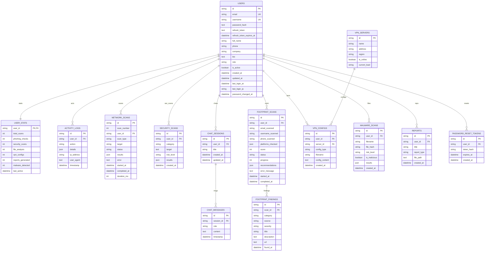

# Entity Relationship Diagram (ERD)

The following diagram visualizes the relationships between the Fsociety database entities.

## Key Relationships

1.  **Users (Central Hub)**:
    -   Stores authentication, profile, and session state (`refresh_token`).
    -   One-to-One with `USER_STATS` for performance.
    -   One-to-Many with all activity and scan history.

2.  **Sessions & Messages**:
    -   Hierarchical relationship between `CHAT_SESSIONS` and `CHAT_MESSAGES`.

3.  **OSINT Architecture**:
    -   `FOOTPRINT_SCANS` extracts multiple `FOOTPRINT_FINDINGS`.

4.  **VPN Infrastructure**:
    -   `VPN_SERVERS` is a static list managed by admins.
    -   `VPN_CONFIGS` links a user to a specific server.

5.  **Audit & Safety**:
    -   `ACTIVITY_LOGS` tracks every major action.
    -   `PASSWORD_RESET_TOKENS` manages account recovery state.
